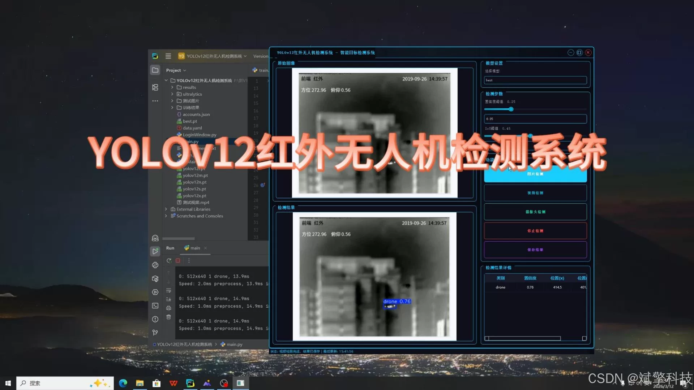
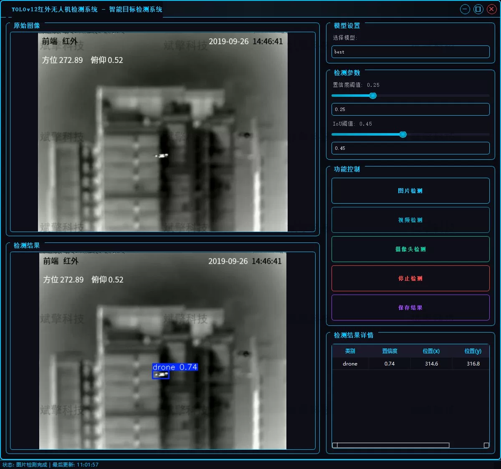
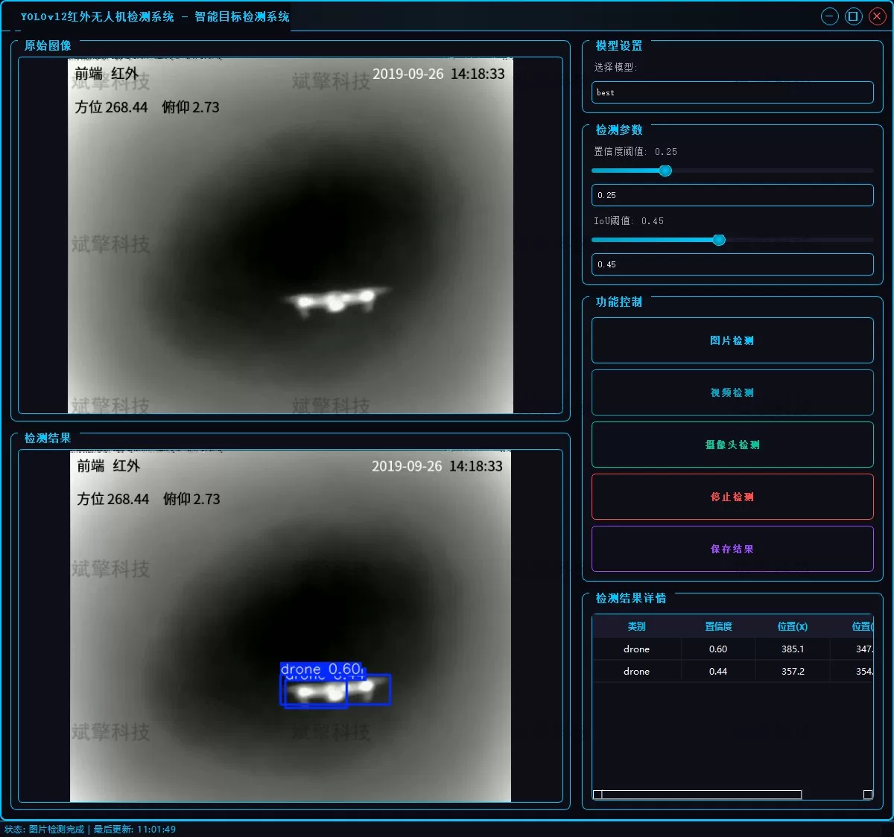
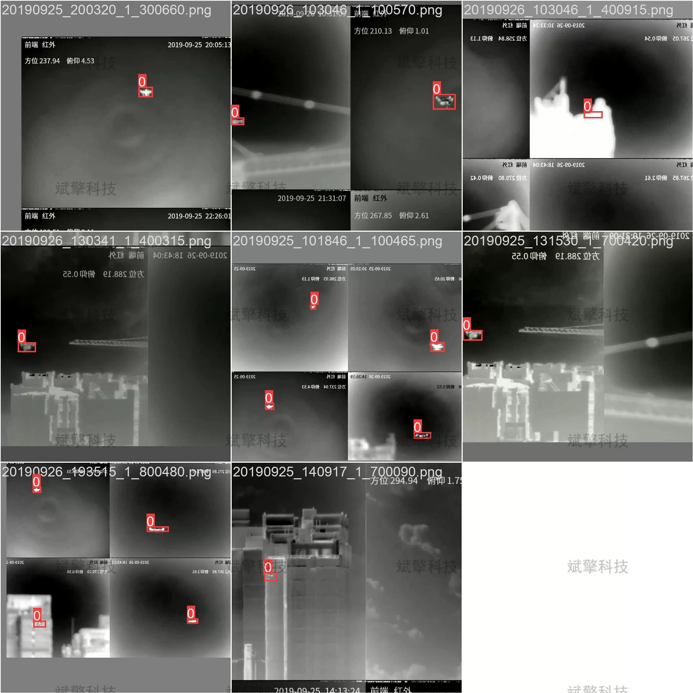

# Infrared UAV detection system based on deep learning YOLOv12 (YOLOv1)

## Body

This project aims to design and implement a real-time infrared drone detection system based on the latest YOLOv12 deep learning algorithm.

The system can efficiently process infrared images and video streams, accurately locate and identify drone targets. The system is comprehensive with support for image detection, video file detection, and real-time camera (infrared device) detection modes. It features fast detection speed, high accuracy, and strong adaptability. Through self-built large-scale infrared drone datasets for training and verification, experimental results show that the model has excellent perception ability for drone targets under infrared scenes, providing effective technical support for low-altitude security, military reconnaissance, and sensitive area protection.

System Function Overview
✅ User login registration: Supports password detection and security verification.
✅ Three detection modes: Based on the YOLOv12 model, supports image, video, and real-time camera detection, accurately recognizes targets.
✅ Dual-screen comparison: Displays original images and detection results on the same screen.
✅ Data visualization: Real-time table displays the category, confidence, and coordinates of detected targets.
✅ Intelligent parameter adjustment: Offers a confidence slide bar to dynamically optimize detection accuracy, adapting to different scene needs.
✅ Sci-fi style interface: Dark theme combined with dynamic light effects, reducing visual fatigue and improving operational experience.
✅ Multi-thread high-performance architecture: Independent detection threads ensure smooth operation, real-time status prompts, and rapid response without lag.
Dataset Introduction
Training set (Train): 5019 images
Validation set (Val): 1233 images

## Images

## Payment

Here is a pay link on Stripe ( https://buy.stripe.com/3cs8yP7sY87d0vu9AB ). Please contact me lonlonago@foxmail.com after funding $89, and I will send you a complete data files , thank you!

